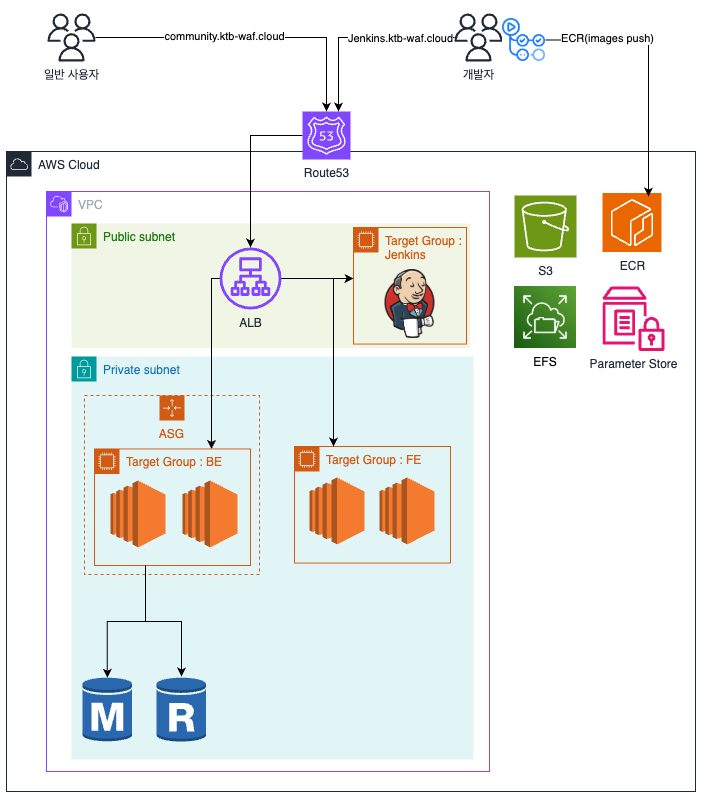

# DC2 커뮤니티 플랫폼 - 백엔드

카카오테크 부트캠프 3기 클라우드 네이티브 과정 - 개인 프로젝트  
(D)개발자 (C)커뮤니티 (C)클럽(DC2) 웹 애플리케이션의 백엔드 API 서버입니다.


## 주요 기능

- 게시글/댓글/좋아요 CRUD
- S3 이미지 업로드 (Presigned URL)
- Cursor/Offset 페이지네이션
- Rate Limiting (Token Bucket)
- JWT 기반 인증/인가 (Access Token 15분, Refresh Token 7일)
- 고아 이미지 자동 정리 배치 (TTL 1시간)
- 좋아요 토글 (Optimistic Update)

## 데모
**서비스**: https://community.ktb-waf.cloud


## 시스템 아키텍처

### 전체 구조



**상세 설계:** [LLD.md Section 2](docs/be/LLD.md#2-시스템-아키텍처)

### AWS 인프라 구성 (백만 MAU 가정)

| 서비스 | 용도 | 주요 설정 |
|--------|------|----------|
| **EC2 (Frontend)** | Express.js 정적 서빙 | - 인스턴스: **t3.micro** (2 vCPU, 1GB RAM)<br>- 이유: 정적 파일 서빙은 리소스 사용량 낮음<br>- 대수: 2대 (무중단 배포용) |
| **EC2 (Backend)** | Spring Boot API 서버 | - 인스턴스: **t3.medium** (2 vCPU, 4GB RAM)<br>- 이유: JVM 안정 구동 (Heap 2GB + OS/Docker 여유분)<br>- 대수: 2대 (무중단 배포용) |
| **ALB** | 로드 밸런서 | - 경로 기반 라우팅 (`/api/v1/*` → BE, `/` → FE)<br>- SSL/TLS Termination (ACM 인증서)<br>- Health Check 기반 트래픽 제어 |
| **RDS MySQL 8.0+** | 데이터베이스 | - 엔진: MySQL 8.0.40<br>- 인스턴스: **db.t3.medium** (2 vCPU, 4GB RAM)<br>- 이유: 읽기 위주 트래픽(93%), 쓰기 비중 낮음<br>- 스토리지: 범용 SSD (gp3), 다중 AZ 비활성 |
| **S3** | 이미지 저장소 | - 업로드: Presigned URL (클라이언트 직접, API 서버 부하 제거)<br>- 리전: `ap-northeast-2`<br>- 고아 이미지 TTL: 1시간 |
| **EFS** | 배포 스크립트 공유 | - 마운트: `/mnt/efs`<br>- 용도: Jenkins 배포 스크립트 공유 (`deploy-backend.sh`)<br>- 모든 EC2 인스턴스에서 동일 스크립트 참조 (ASG 대응) |
| **SSM Parameter Store** | 환경 변수 중앙 관리 | - 7개 파라미터 (DB, JWT, S3, FE URL)<br>- SecureString: DB 비밀번호, JWT Secret<br>- Jenkins 배포 시 자동 주입 |
| **ECR** | 컨테이너 레지스트리 | - 리포지토리: `ktb-personal`<br>- 이미지: `be-latest`, `be-{timestamp}`<br>- OIDC 인증 (무자격증명) |

**스펙 선정 근거:**
- **FE (t3.micro × 2대)**: 정적 파일 서빙은 메모리/CPU 사용량 극히 낮음, 2대 구성으로 무중단 배포 지원
- **BE (t3.medium × 2대)**:
  - JVM 안정 구동: 최소 4GB RAM 필요 (OS 0.5GB + Docker 0.5GB + JVM Heap 2GB + 여유 1GB)
  - t3.small(2GB)은 JVM Heap을 1GB 미만으로만 설정 가능 → GC 빈번, 성능 저하
  - 2대 구성: ALB가 순차 배포 중 트래픽을 정상 인스턴스로 라우팅 (무중단 배포)
- **RDS (db.t3.medium)**: 읽기 위주 워크로드(93%)로 t3 계열 충분, 향후 트래픽 증가 시 스케일업 고려

**상세 가이드:**
- **RDS 설정**: [EC2-DEPENDENCIES.md Section 2](docs/deployment/EC2-DEPENDENCIES.md#2-mysql-80-또는-rds)
- **S3 권한**: EC2 IAM Role에 S3 접근 권한 필요
- **EFS 마운트**: [EC2-DEPENDENCIES.md Section 7](docs/deployment/EC2-DEPENDENCIES.md#7-efs-마운트-배포-스크립트-공유)
- **SSM 파라미터**: [CI-CD.md Section 환경 변수 관리](docs/deployment/CI-CD.md#환경-변수-관리)

### CI/CD 파이프라인
```
GitHub (PR Merge to deploy) → GitHub Actions (Public)
  ├── Test & Build (gradlew test)
  ├── Docker Image Build & Push to ECR (OIDC 인증)
  └── Trigger Jenkins (HTTP API)
        ↓
      Jenkins (Private Subnet 접근)
  ├── ALB Target Group API 조회 (ASG 환경 대응, 동적 배포 대상 탐색)
  ├── SSM Parameter Store에서 환경 변수 로드
  └── Target Group 내 모든 EC2에 순차 SSH 배포 (Rolling Update)
```

### 배포 전략
- **Rolling Update (무중단 배포)**:
    1. Jenkins가 ALB Target Group API로 현재 활성 인스턴스 목록 조회
    2. EC2-1 배포 시작 → ALB가 EC2-1을 Unhealthy로 마킹 → 트래픽 EC2-2로 전환
    3. EC2-1 배포 완료 → Health Check 통과 → ALB가 다시 트래픽 분산
    4. EC2-2 배포 (동일 프로세스 반복)
- **ASG 대응**: IP 하드코딩 없이 Target Group 기반 조회로 인스턴스 증감 자동 대응
- **EFS 공유**: 모든 EC2가 `/mnt/efs/deploy/` 스크립트 참조, 배포 로직 중앙 관리


## 관련 레포지토리

**프론트엔드**: [3-waf-jung-community-FE](https://github.com/100-hours-a-week/3-waf-jung-community-FE)

## 기술 스택

- **Framework**: Spring Boot 3.5.6
- **Language**: Java 21 LTS
- **Build**: Gradle 8.14.3
- **Database**: MySQL 8.0+ (JPA/Hibernate, HikariCP)
- **Security**: Spring Security, JWT (jjwt 0.12.3), BCrypt
- **Rate Limiting**: Bucket4j 8.10.1
- **Infrastructure (AWS)**:
  - **Compute**: EC2 (Private Subnet, ASG 대응)
  - **Load Balancer**: ALB (경로 기반 라우팅)
  - **Database**: RDS MySQL 8.0.40 (db.t3.micro)
  - **Storage**: S3 (이미지, Presigned URL)
  - **File System**: EFS (배포 스크립트 공유)
  - **Container Registry**: ECR (OIDC 인증)
  - **Secrets**: SSM Parameter Store (환경 변수)
- **CI/CD**: GitHub Actions + Jenkins

## 시작하기

### 사전 요구사항
- Java 21 이상
- MySQL 8.0 이상
- Gradle 8.14.3 이상 (또는 ./gradlew 사용)

### 설치

```bash
git clone https://github.com/<org>/3-waf-jung-community-BE.git
cd 3-waf-jung-community-BE
./gradlew build
```

### 환경 변수 설정

```bash
# application.properties 또는 환경 변수로 설정
DB_URL=jdbc:mysql://localhost:3306/community
DB_USERNAME=root
DB_PASSWORD=your_password
JWT_SECRET=your_256bit_secret_key
AWS_S3_BUCKET=your-s3-bucket
AWS_REGION=ap-northeast-2
FRONTEND_URL=http://localhost:3000
```

### 실행

```bash
# 개발 모드
./gradlew bootRun

# JAR 빌드 후 실행
./gradlew bootJar
java -jar build/libs/community-0.0.1-SNAPSHOT.jar
```

**접속**: http://localhost:8080  
**헬스체크**: http://localhost:8080/health

## 프로젝트 구조

```
src/main/java/com/ktb/community/
├── config/              # 설정 (Security, JPA, S3, Rate Limit)
├── controller/          # REST API 엔드포인트
├── service/             # 비즈니스 로직
├── repository/          # 데이터 접근 (JPA)
├── entity/              # JPA 엔티티 (8개)
├── dto/                 # 요청/응답 DTO
│   ├── request/
│   └── response/
├── security/            # JWT, 인증 필터
├── exception/           # 예외 처리
├── enums/               # Enum 클래스
└── util/                # 유틸리티 (Validator 등)

docs/be/                 # 백엔드 문서
├── PLAN.md              # Phase별 구현 계획
├── PRD.md               # 요구사항 명세
├── LLD.md               # Low Level Design
├── API.md               # API 명세
└── DDL.md               # 데이터베이스 스키마
```

## 개발 문서

- **[CLAUDE.md](CLAUDE.md)**: Claude Code 작업 가이드 (프로젝트 개요, 개발 규칙)
- **[docs/be/PLAN.md](docs/be/PLAN.md)**: Phase별 구현 계획 및 체크리스트
- **[docs/be/PRD.md](docs/be/PRD.md)**: 기능/비기능 요구사항 (FR/NFR 코드)
- **[docs/be/LLD.md](docs/be/LLD.md)**: 설계 문서 (아키텍처, 패턴, 동시성 제어)
- **[docs/be/API.md](docs/be/API.md)**: API 엔드포인트 명세 (요청/응답)
- **[docs/be/DDL.md](docs/be/DDL.md)**: 데이터베이스 스키마 및 인덱스

## API 엔드포인트

**Base URL**: `/api/v1` (프로덕션), `/` (로컬)

| 도메인 | 엔드포인트 | 설명 |
|--------|-----------|------|
| 인증 | POST /auth/login | 로그인 |
| 인증 | POST /auth/logout | 로그아웃 |
| 인증 | POST /auth/refresh_token | 토큰 갱신 |
| 사용자 | POST /users/signup | 회원가입 |
| 사용자 | GET /users/{id} | 프로필 조회 |
| 게시글 | GET /posts | 게시글 목록 |
| 게시글 | POST /posts | 게시글 작성 |
| 게시글 | GET /posts/{id} | 게시글 상세 |
| 댓글 | POST /posts/{id}/comments | 댓글 작성 |
| 좋아요 | POST /posts/{id}/like | 좋아요 토글 |
| 이미지 | POST /images | 이미지 업로드 |
| 이미지 | GET /images/presigned-url | Presigned URL 발급 |
| 시스템 | GET /health | 헬스체크 |
| 시스템 | GET /stats | 플랫폼 통계 |

**상세 API 명세**: [docs/be/API.md](docs/be/API.md)
